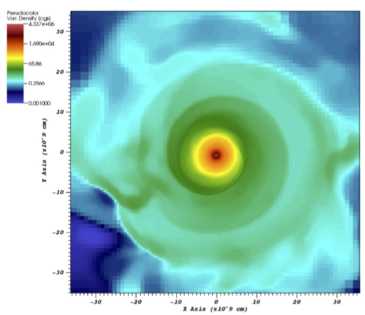

1. Simulating 3D Merger Events to 1D Stellar Evolution

|  |
|:--:|
| *Pseudocolor plot of the density in a slice of the equatorial plane after 3.3 hr of evolution time. This is from a simulation of a 0.53 solar mass carbox-oxygen white dwarf and a 0.32 solar mass helium white dwarf merger* |

[Munson et al. 2021](https://ui.adsabs.harvard.edu/abs/2021ApJ...911..103M/abstract)

3. Simulating a Red Super Giant Star Merging with a Main-Sequence Star
4. Reproducing 
